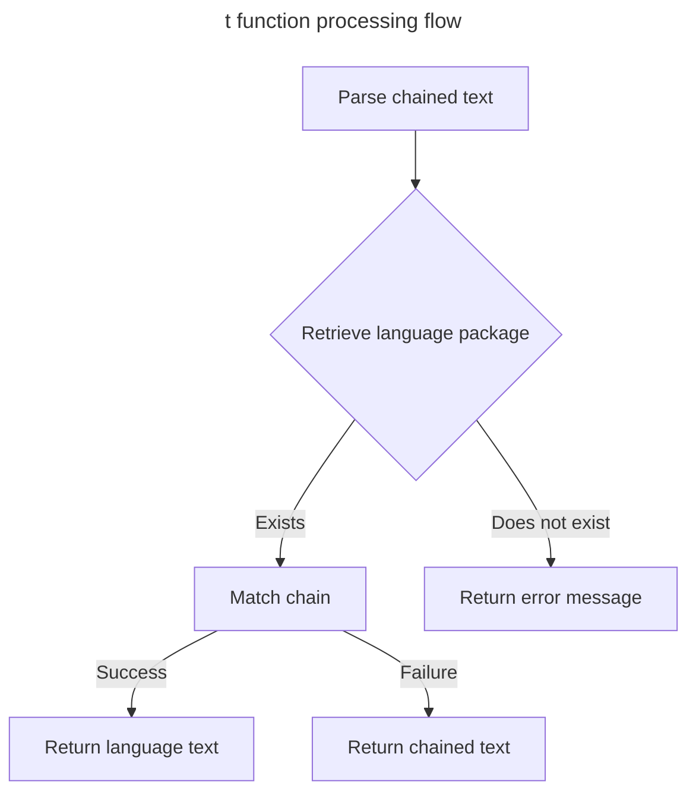

In modern web development, internationalization is typically a frontend concern. However, in international scenarios, backend internationalization is an indispensable component. It enables locale-specific feedback to users in their native language, greatly benefiting a global audience.

## Syntax

Similar to common frontend usage, simply use the `t()` function + chained text. For example:

- `t('response.success')`

Retrieves the value of the success field under response in the language package.

- `t('error.captcha.expired')`

Retrieves the value of the expired field under captcha under error in the language package.

## Default Language

You can set the default language in the [configuration file](./config.md)

## Dynamic Switching

fba automatically retrieves the `Accept-Language` parameter from request headers and applies the first parameter value as the current language. If this parameter doesn't exist, the default language is applied.

## Language Packages

Language packages are located in the `backend/app/locale` directory

### Naming

Language package file names typically follow country/region codes. For example, `en-US` represents American English, `en-GB` represents British English, `ru-RU` represents Simplified Chinese, `zh-TW`
represents Traditional Chinese...

### Format

Language packages currently support two formats:

- json
- yaml / yml
